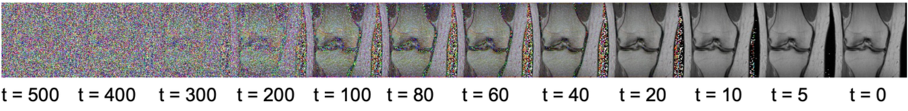

<a id="readme-top"></a>

[![MIT License][license-shield]][license-url]
[![LinkedIn][linkedin-shield]][linkedin-url]

<!-- PROJECT LOGO -->
<br />
<div align="center">
  <a href="https://github.com/othneildrew/Best-README-Template">
    
  </a>

  <h3 align="center">A systematic evaluation of diffusion model-based domain transfer<br> - <br> A clinical validation study</h3>

  <p align="center">
    <br />
    <a href="https://github.com/cederican/diffusion_autoenc/issues">Report Bug</a>
    ·
    <a href="https://github.com/cederican/diffusion_autoenc/issues">Request Feature</a>
  </p>
</div>

<!-- TABLE OF CONTENTS -->
<details>
  <summary>Table of Contents</summary>
  <ol>
    <li>
      <a href="#about-the-project">About The Project</a>
      </ul>
    </li>
    <li>
      <a href="#getting-started">Getting Started</a>
      <ul>
        <li><a href="#installation">Installation</a></li>
        <li><a href="#prerequisites">Prerequisites</a></li>
        <li><a href="#lmdb-datasets">LMDB Datasets</a></li>
        <li><a href="#training">Training</a></li>
        <li><a href="#evaluation">Evaluation</a></li>
        <li><a href="#mri-latent-diffusion-and-interpolation ">MRI latent diffusion and interpolation </a></li>
        <li><a href="#mri-sequence-conversion">MRI sequence conversion</a></li>
      </ul>
    </li>
    <li><a href="#license">License</a></li>
    <li><a href="#contact">Contact</a></li>
    <li><a href="#acknowledgments">Acknowledgments</a></li>
  </ol>
</details>

<!-- ABOUT THE PROJECT -->
## About The Project

This project explores feature representations across different MRI sequences and evaluates the potential of diffusion models for MRI sequence transfer. The primary aim is to determine whether these models can facilitate the transfer of specific sequence features while maintaining their integrity, allowing their use in other machine learning applications within radiology.

A Diffusion Autoencoder architecture was implemented and adapted, trained on open-source MRI datasets such as MRNet and FastMRI, along with a test dataset of self-acquired MRI data. The study revealed that while the model successfully captured and transferred certain signal features, further improvements are required to achieve full anatomical consistency. This work represents a promising step toward creating versatile tools that can adapt radiological models to various MRI sequences, demonstrating the application of state-of-the-art machine learning techniques to address real-world clinical challenges.


<p align="right">(<a href="#readme-top">back to top</a>)</p>

<!-- GETTING STARTED -->
## Getting Started

To get a local copy follow these simple steps.

### Installation

* clone the repo
   ```sh
   git clone https://github.com/cederican/diffusion_autoenc.git
   ```

### Prerequisites

See `requirements.txt`

```
pip install -r requirements.txt
```

### LMDB Datasets

We do not own any of the following datasets.
* [MRNet dataset](https://stanfordmlgroup.github.io/competitions/mrnet/)
* [fastMRI dataset](https://fastmri.med.nyu.edu)

 We provide the LMDB ready-to-use dataset for the sake of convenience.

- [MRI_COR] in Coscine M&M 
- [MRI_COR2] in Coscine M&M

The directory tree should be:

```
datasets/
- FastMRI_cor2.lmdb
- FastMRI_cor.lmdb
```


## Training

We provide scripts for training & evaluate DiffAE (including latent DPM) on the following datasets: MRI Knee COR.
Usually, the evaluation results (FID's) will be available in `eval` directory.

Note: Most experiment requires at least 4x V100s during training the DPM models while requiring 1x 2080Ti during training the accompanying latent DPM. Or reduce the batch size.


**MRI Knee COR**
```
# diffae
python run_mri.py
```

A classifier (for manipulation) can be trained using:
```
python run_mri_cls.py
```

## Evaluation

```
# evaluate diffusion autoencoder
python test_autoencoding.py

# evaluate latent sampling and interpolation
python test_interpolate.py
python test_sample.py

# evaluate sequence conversion
python test_manipulate.py

# cool visualizations
python test_giftorow.py
python test_diffaenoise.py

```

<!-- USAGE EXAMPLES -->
## MRI latent diffusion and interpolation 




_For more examples, please refer to the [Thesis](Thesis/BA_Cederic_final.pdf)_

<p align="right">(<a href="#readme-top">back to top</a>)</p>

<!-- USAGE EXAMPLES -->
## MRI sequence conversion


_For more examples, please refer to the [Thesis](Thesis/BA_Cederic_final.pdf)_

<p align="right">(<a href="#readme-top">back to top</a>)</p>

<!-- LICENSE -->
## License

Distributed under the MIT License. See `LICENSE.txt` for more information.

<p align="right">(<a href="#readme-top">back to top</a>)</p>


<!-- CONTACT -->
## Contact

Cederic Aßmann - cederic.assmann@icloud.com

Project Link: [https://github.com/cederican/diffusion_autoenc](https://github.com/cederican/diffusion_autoenc)

<p align="right">(<a href="#readme-top">back to top</a>)</p>


<!-- ACKNOWLEDGMENTS -->
## Acknowledgments

Official implementation of the Diffusion Autoencoder

A CVPR 2022 (ORAL) paper ([paper](https://openaccess.thecvf.com/content/CVPR2022/html/Preechakul_Diffusion_Autoencoders_Toward_a_Meaningful_and_Decodable_Representation_CVPR_2022_paper.html), [site](https://diff-ae.github.io/), [5-min video](https://youtu.be/i3rjEsiHoUU)):

```
@inproceedings{preechakul2021diffusion,
      title={Diffusion Autoencoders: Toward a Meaningful and Decodable Representation}, 
      author={Preechakul, Konpat and Chatthee, Nattanat and Wizadwongsa, Suttisak and Suwajanakorn, Supasorn},
      booktitle={IEEE Conference on Computer Vision and Pattern Recognition (CVPR)}, 
      year={2022},
}
```

Helpful libraries and public available datasets

* [MRNet dataset](https://stanfordmlgroup.github.io/competitions/mrnet/)
* [fastMRI dataset](https://fastmri.med.nyu.edu)
* [WandB](https://wandb.ai/site)

<p align="right">(<a href="#readme-top">back to top</a>)</p>


<!-- MARKDOWN LINKS & IMAGES -->
<!-- https://www.markdownguide.org/basic-syntax/#reference-style-links -->
[license-shield]: https://img.shields.io/github/license/othneildrew/Best-README-Template.svg?style=for-the-badge
[license-url]: LICENSE.txt
[linkedin-shield]: https://img.shields.io/badge/-LinkedIn-black.svg?style=for-the-badge&logo=linkedin&colorB=555
[linkedin-url]: https://www.linkedin.com/in/cederic-aßmann-41904322b/


